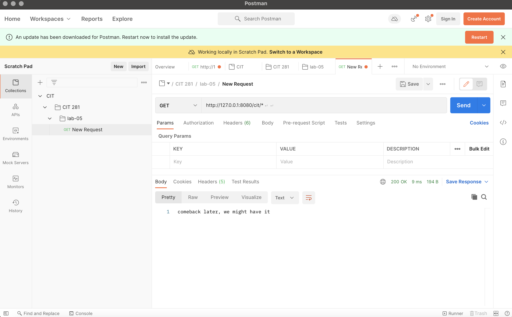

# cit281-lab-5.io
lab 5

This la bintroduces uus to Postman. It required us to create a CIT 281 collection and folders. It also required us to create a Node.js and fastify server application with GET and respond with JSON.

Postman provides a more effective way to test the web server. 

here are some postman testing examples:

